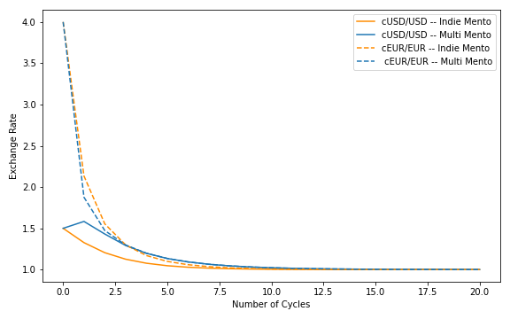

# Table of Contents

1. [Mental Model of the Dynamics to Maintain the Peg](#mental-model-of-the-dynamics-to-maintain-the-peg)
2. [Mathematical Model of the Dynamics](#mathematical-model-of-the-dynamics)
   1. [Equilibrium State](#equilibrium-state)
   2. [Independent Mentos](#independent-mentos)
   3. [Multi Mento](#multi_mento)
3. [Comparison of Speed of Convergence](#comparison-of-speed-of-convergence)
   1. [Model Parameter](#model-paramter)
   2. [Assumptions / Limitations](#assumptions-/-limitations)
   3. [Single Depeg](#single-depeg)
   4. [Double Depeg same Direction](#double-depeg-same-direction)
   5. [Double Depeg opposite Direction](#double-depeg-opposite-direction)
4. [Open Problems](#open-problems)
   1. [Independent Mentos - Open Problems](#independent-mentos---open-problems)
   2. [Multi Mento - Open Problems](#multi-mento---open-problems)

# Mental Model of the Dynamics to Maintain the Peg:

We are providing a mental model to get familiar with the different dynamics behind Independent Mentos and Multi Mento.

Assume cUSD/USD is depegged while cEUR/EUR is pegged.

**Independent Mentos:**

According to the stability protocol the on-Chain price will be overwritten with the Celo/USD price creating arbitrage opportunities. We believe that due to arbitrage trades the Celo and the cUSD supply in the market will change inversely proportionally. The prices of Celo/cUSD and Celo/USD will both change because they are sensitive to changes of the Celo and/or cUSD supply; Celo/cUSD should see faster price adjustments than Celo/USD as it is sensitive to Celo and cUSD while Celo/USD is only sensitive to Celo

Celo/EUR and Celo/cEUR are also sensitive to Celo supply. So both prices will change too. Likely, the price change will be similar, such that cEUR/EUR stays pegged.

**Multi Mento:**

The dynamics will be similar up to the point that trades in Celo and cUSD with Mento will affect the onChain Celo/cEUR price as the Celo/cEUR price is sensitive to the Celo tank. As a consequence Celo/cUSD trades can cause 'unintended' arbitrage opportunities for the Celo/cEUR pair; if this opportunity is taken the cEUR/EUR is likely to deviate from the peg temporarily to find the peg together with cUSD/USD again.

# Mathematical Model of the Dynamics

The model setup can be decomposed into two components: the on-chain market and the open market. The on-chain market is following the Mento mechanism. The on-chain prices of CELO at time  quoted in cUSD and cEUR are denoted by  and . On-chain cUSD, cEUR and CELO are represented by buckets. In the case of Independent Mentos each Mento mechanism features its own independent CELO bucket, in the case of Multi Mento the mechanism features only one CELO bucket. We denote the amount of cUSD, cEUR and CELO in each bucket at time  by

At the time of an oracle update  the amount of CELO  is chosen as a fraction ,  of the CELO amount in the reserve

and the Celo Dollar amount is set to

Due to the constant-product market maker the following equations are satisfied at all times  and  within one oracle update cycle:

For the open market we are considering cUSD, cEUR, CELO, US Dollar and Euro each represented by a hypothetical tank with tank size , , ,  and . We denote the market prices by , ,  ,  and . This convention follows the rule that a symbol '' denotes the price of currency in sub-script quoted in the currency in super-script. We are assuming that all arbitrage opportunities within the currency triangle of the open market will immediately vanish due to arbitrage trading. In particular, we are assuming

Tank sizes and market prices are related by the assumption that the relative sizes of the
tanks are given by:

## Equilibrium State

Under the assumption that the Celo Dollar or Celo Euro price at time  have deviated from the peg it follows that the CELO price quoted in US Dollar  or in Euro  are different from the CELO price quoted in cUSD  or cEUR , respectively

By construction, at time  of an oracle update the on-chain CELO prices  and  (quoted in Celo Dollar and Celo Euro) are equal to the market CELO prices  and 

Therefore, the on-chain CELO prices  and  are different from the market CELO prices  and 

From the perspective of arbitrage traders four cases of price mismatches are profitable:

-  which is equivalent to 
-  which is equivalent to 
-  which is equivalent to 
-  which is equivalent to 

In four cases and combinations we are assuming that arbitrage traders will take advantage of the arbitrage opportunity until it vanishes at time , i.e. until  and . We refer to this state as the equilibrium state.

## Independent Mentos

The equilibrium state of one single module Mento is described by the following set of equations of unknown time t_e quantities:

We have chosen the Celo Dollar Mento but the set of equation in another currency is analogous. A more detailed analysis including fees is provided in [https://celo.org/papers/Celo_Stability_Analysis.pdf](https://celo.org/papers/Celo_Stability_Analysis.pdf) .

The set of equations of two Mento modules (cUSD and cEUR) is given by

:warning: We have not been able so far to perform a feasable analysis of equilibrium dynamics based on these equations (see [Open Problems](#open-problems)). Instead we are trying to approximate the dynamics of Independent Mentos by assuming the Mento modules would operate sequentially.

This means, instead of allowing the two arbitrage cycles to be operating in parallel, we assume that the cUSD arbitrage cycle of the Celo Dollar Mento would operate and finish and then the cEUR arbitrage cycle would operate and finish.

## Multi Mento

The equilibrium state of Multi Mento is described by the following set of equations of unknown time  quantities:

We fully solved this set of equation without fees. The case with fees is also solved apart from the case of one currency being above the peg and the second below.

# Comparison of Speed of Convergence

## Model Parameter

| Tanks            | Amount             |
| ---------------- | ------------------ |
| USD Market Tank  | 30000              |
| EUR Market Tank  | 20000              |
| cUSD Market Tank | 20000              |
| cEUR Market Tank | 20000, 40000, 5000 |
| Celo Market Tank | 10000              |
| Reserve          | 1000000            |
| Reserve Fraction | 0.01               |

## Assumptions / Limitations

- We were not able to set up a feasible model for Independent Mentos Therefore, we assume they would operate sequentially. This means, instead of allowing the two arbitrage cycles to be operating in parallel, we assume that the cUSD arbitrage cycle of the Celo Dollar Mento would operate and finish and then the cEUR arbitrage cycle would operate and finish.
- We assumed the same reserve fraction for cUSD Mento and cEUR Mento for Independent Mentos, but twice the reserve fraction for Multi Mento, because we wanted to have comparable overall Celo utilisation for the two approaches, i.e. the sum of the Celo tank in the cEUR Mento and the cUSD Mento is equal to single Celo tank in Multi Mento. (For uniform tank sizes across stable coins and approaches refer to [Additional Parameter Settings](multi_ccy_support-analysis_additional_parameter_settings.md))
- We set fees to zero, as we were not able to solve the set of equations for Multi Mento for a double depeg in opposite directions yet with fees yet.
- All observations have to be considered as statements that are only true
  within this model setup. They cannot be directly transferred to real market situations. However,
  they help to gauge expectations of the effect of the two approaches and to compare them against each other.

:warning: For additional parameter settings refer to the following sub-page:

[Additional Parameter Settings](multi_ccy_support-analysis_additional_parameter_settings.md)

## Single Depeg

cUSD/USD = 1.5 and cEUR/EUR = 1

The overall speed of convergence () is of the same scale. Multi Mento has faster short term convergence in terms of maximum deviation (). In the tail, the speed of convergence of Independent Mentos is slightly faster overall as well as in terms of maximum deviation. As the on-chain price of cEUR is sensitive to cUSD transactions due to the shared CELO bucket, the cEUR price depegs because of cUSD arbitrage trades. Once cUSD and cEUR price have reached the same value, the price sensitivity is the same. We have also discussed this behavior in our [mental model of the dynamics.]()

## Double Depeg Same Direction

cUSD/USD = 1.5 and cEUR/EUR = 4

The overall speed of convergence () is of the same scale. Multi Mento has faster short term convergence in terms of maximum deviation (). In the tail, the speed of convergence of Independent Mentos slightly faster overall as well as in terms of maximum deviation. As the on-chain price of cEUR is sensitive to cUSD transactions due to the shared CELO bucket, the depeg of cEUR price is further initially because of cUSD arbitrage trades. Once cUSD and cEUR have reached the same value, the price sensitivity is the same. We have also discussed this behavior in our [mental model of the dynamics.](#mental-model-of-the-dynamics-to-maintain-the-peg)

## Double Depeg Opposite Direction

cUSD/USD = 1.5 and cEUR/EUR = 0.5

In this case the speed of convergence of Multi Mento is faster than the speed of Independent Mentos in terms of sum of absolute values as well as maximum deviation. In this scenario the dynamic of Multi Mento is benefitting from cross-currency price sensitivity which adds speed to the convergence toward the peg. This is in contrast to the two cases we have discussed before, where cross-currency sensitivity increased the deviation from peg of one stable coin during the first update cycles until both prices matched.

# Open Problems

In this section we are listing problems of the mathematical model, that we have not been able to fully analyse yet:

- Simultaneous dynamics of Independent Mentos with and without fees
- Simultaneous dynamcs of Multi Mento with fees:
  - correct application of fees in case simultaneous expansion in one currency and contraction in the other currency.

## Independent Mentos - Open Problems

As discussed above we have not been able yet to make use of the solutions of the set of equations of the equilibrium state. We are introducing some further notation to shorten expressions in the equations above

where  and  are the constant products of the initial cUSD and cEUR Mentos and , and  are the initial total amounts of cUSD, cEUR and CELO.

Starting with

and by using the 'constant product' equation (fourth equation) and the sixth equation for the total number cEUR, we obtain

We retrieve a similar equation for cUSD

As  and  it follows

Inserting these solutions into the quadratic expression yields the following solutions

and

Polynomial equations for the other unkown quantities (, ,  etc.) at  can be obtained from these two polynomials. In general, polynomials of degree 4 are solvable. Unfortunately, solutions are rather lenghty and often imaginary. We were not able to perform a feasable analysis of the equilibrium dynamics based on these solutions.

## Multi Mento - Open Problems

As mentioned above, the price of each currency can be in two states that will be profitable for an arbitrage trader. As a pair of two currency there can be four different scenarios that can be profitable

- one currency is depegged
- cUSD/USD and cEUR/EUR are above 1
- cUSD/USD and cEUR/EUR are below 1
- cUSD/USD is above 1 and cEUR/EUR is below 1 (or equivalently cUSD/USD is below 1 and cEUR/EUR is above 1)

We have been able to cover all of them in our analysis excluding fees and all but one scenario including fees.

The set equations of the scenario in which fees are included, one price is above 1 and the other one price is below 1 has not been solved yet.

### [WIP] cUSD/USD above 1 and cEUR/EUR below 1

