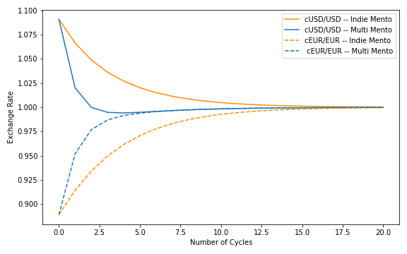

# Table of Contents

1. [Milder Depeg Scenarios](#milder_depeg_scenarios)
   1. [Model Parameter](#model-parameter)
   2. [Single Depeg](#single-depeg)
   3. [Double Depeg same Direction](#double-depeg-same-direction)
   4. [Double Depeg opposite Direction](#double-depeg-opposite-direction)
2. [Uniformly sized On-Chain Celo Buckets](#uniformly-sized-on-chain-celo-buckets)
   1. [Single Depeg](#single-depeg)
   2. [Double Depeg same Direction](#double-depeg-same-direction)
   3. [Double Depeg opposite Direction](#double-depeg-opposite-direction)

# Milder Depeg Scenarios

In this section we are presenting additional analyses of the speed of convergence. We analyse the same three scenarios as before. But we are setting less extreme initial cUSD/USD and cEUR/EUR prices.

## Model Parameter

| Tanks            | Amount              |
| ---------------- | ------------------- |
| USD Market Tank  | 30000               |
| EUR Market Tank  | 20000               |
| cUSD Market Tank | 27500               |
| cEUR Market Tank | 20000, 22500, 17500 |
| Celo Market Tank | 10000               |
| Reserve          | 1000000             |
| Reserve Fraction | 0.01                |

## Single Depeg

cUSD/USD = 1.09 and cEUR/EUR = 1

The dynamics in the case of less extreme initial price deviations is very similar to the dynamics in the case of extreme price deviations. Again the speed of convergence in terms of sum of absolute values is close and in terms of maximum of absolute values Multi Mento is faster short term, but shows the same initial depegging of cEUR/EUR as well as slightly slower convergence in the tail.

## Double Depeg Same Direction

cUSD/USD = 1.09 and cEUR/EUR = 1.14

The dynamics in the case of less extreme initial price deviations is very similar to the dynamics in the case of extreme price deviations. The difference of the initial price levels of cUSD/USD and cEUR/EUR is much smaller and therefore the entire evolution of the prices occurs in a much tighter 'wedge'. The short term advantage in speed of convergence in terms of sum of absolute values of Multi Mento seems much smaller. As a another consequence of the smaller difference of the initial price levels, the cEUR/EUR price does not deviate away from the peg intitially, but only shows a smaller slope during the first update cycle.

## Double Depeg Opposite Direction

cUSD/USD = 1.09 and cEUR/EUR = 0.89

As before, in this scenario the speed of convergence of Multi Mento is faster than Independent Mentos in terms of sum of absolute values as well as maximum deviation.

# Uniformly sized On-Chain Celo Buckets

As we have described above to compare the speed of convergence of Independent Mentos and Multi Mento we have assumed the same reserve fraction for cUSD Mento and cEUR Mento for Independent Mentos, but twice the reserve fraction for Multi Mento, because we wanted to have comparable overall Celo utilisation for the two approaches. In this section we use a different assumption, we use the same reserve fraction for all Celo buckets in Independent Mentos as well as Multi Mento. As a consequence twice the amount of Celo is available for Independent Mentos to fuel the stability mechanism compared to Multi Mento.

## Single Depeg

cUSD/USD = 1.09 and cEUR/EUR = 1

Naturally, the evolution of the prices is the same in the case of Independent Mentos. The speed of convergence in the case of Multi Mento is slower, because the on-chain buckets are half the size they have been before. Initially, the Celo bucket of cUSD Mento and Multi Mento are equal. Multi Mento is utilising on-chain resources to decrease the cUSD/USD price but also to increase the cEUR/EUR. As discussed before this results in a slightly faster speed in convergence in terms of maximum of absolute values. It is interesting that this still occurs with half the reserve fraction of before. At some point the speed of convergence of Independent Mentos is faster in terms of sum as well as maximum of absolute values. Once again, this shows the faster speed of convergence of Independent Mentos in the tail. Under these bucket size settings it becomes more obvious, as Multi Mento has to fuel the recovery of the peg for cUSD/USD and cEUR/EUR with half the amount of Celo as before.

## Double Depeg Same Direction

cUSD/USD = 1.09 and cEUR/EUR = 1.14

In this scenario the lower amount of Celo is most obvious. With only half of the Celo amount available on-chain the speed of convergence of Multi Mento is slower than the speed of Independent Mentos in terms of sum and maximum of absolute across all time intervals.

## Double Depeg Opposite Direction

cUSD/USD = 1.09 and cEUR/EUR = 0.89

Even with only half of the Celo amount available the speed of convergence of Multi Mento is faster than the speed of Independent Mentos in terms of sum of absolute values as well as maximum deviation. As we have discussed before this is due to the cross-currency price sensitivity which adds speed to the convergence toward the peg in this scenario.
