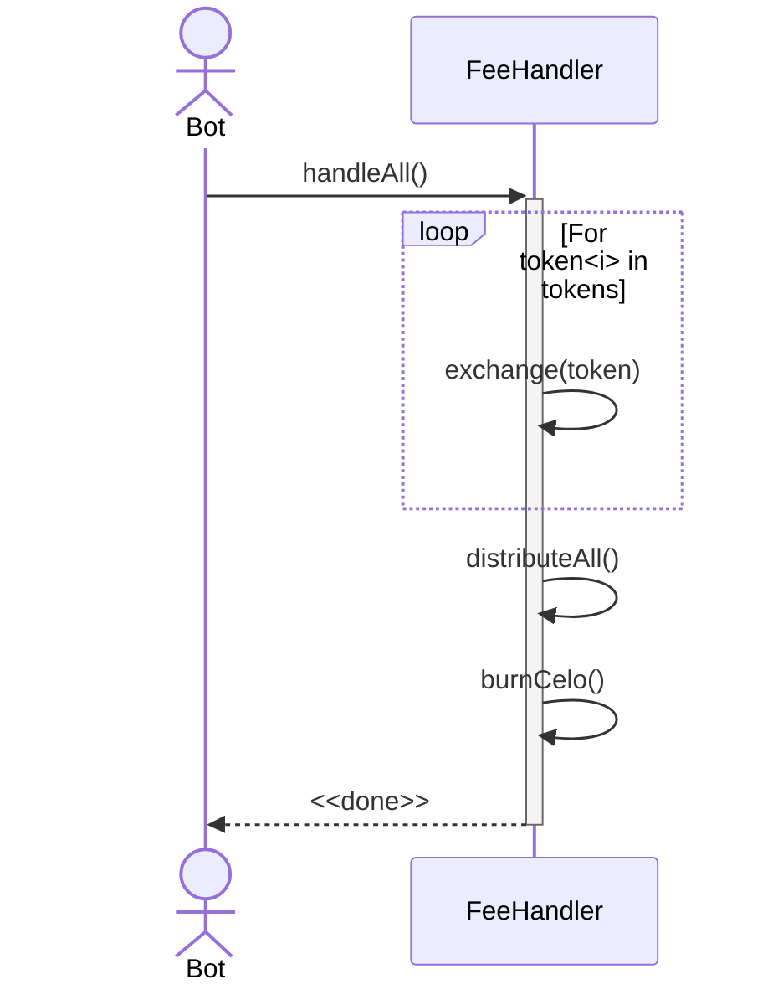
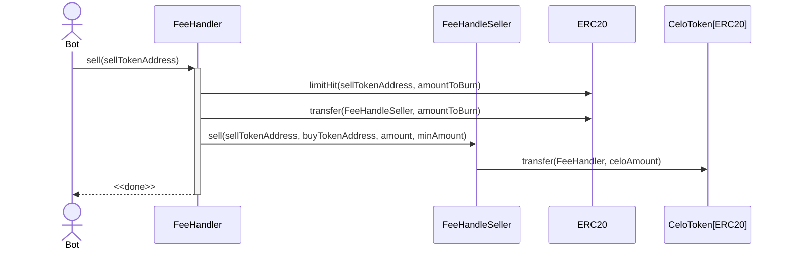
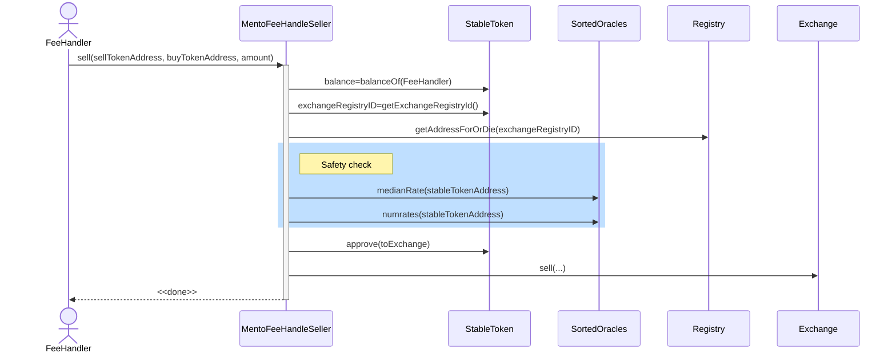
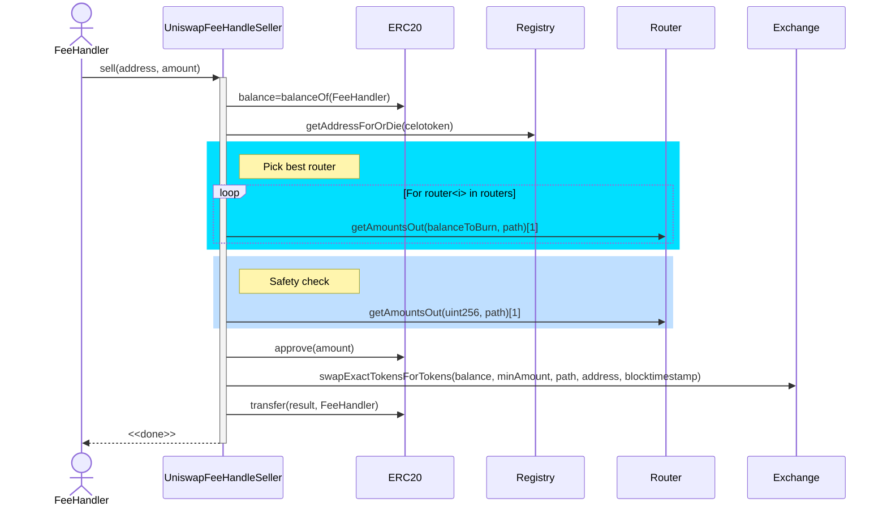

## Simple Summary
Celo since its inception, in April 2020, had a focus on creating a positive impact on the planet, becoming the first carbon-negative blockchain. This proposal wants to take that effort further and redistribute 20% of transaction's base fees to a new Green Fund (GF) and burn the remaining 80%. All base fees are currently sent fully to the Community Fund. The on-chain [Carbon Offsetting Fund](https://docs.celo.org/protocol/pos/epoch-rewards-carbon-offsetting-fund) also aims to be overhauled for a more transparent approach.

## Abstract
This proposal aims to outline the requirements to make Celo fund on-chain ReFi initiatives with 20% of the base fees collected from transactions. The other 80% aims to improve the already deflationary tokenomics by burning it. The Carbon Offsetting Fund is meant to be transferred to an on-chain contract owned by Governance.

## Motivation
1. To create a Green Fund on-chain and fund it with the former Celo Carbon Offset fund.
2. To allocate 20% of the base fees (of both Celo and non-Celo tokens) to a Green Fund.
3. To burn the rest 80% of Celo tokens in the base fee.
4. To exchange rest 80% of non-Celo tokens for Celo and burn it.

## Specification

## Green Fund contract

The Green Fund will start as a Multisig and after iterating it can become a core contract. Its purpose is to receive assets from different sources (Epoch rewards, base fees, donations, etc) and turn those assets into on-chain ReFi initiatives. For example, it can buy Carbon Credits.

The reason to start off with a multisig is to make things more flexible, for example a particular project that the contract wants to interact with may be different from simply buying an ERC20, like buying an NFT or depositing liquidity.

### Redirecting Celo Carbon Offset Fund to Green Fund

This can be done with a simple governance proposal. This proposal can as well include directions about what tokens to buy and some high level guidelines.

The proposal can change the Carbon Offset Fund via a Governance Proposal by executing `EpochRewards.setCarbonOffsettingFund(address partner=Green Fund multisig address, uint256 value=current value)`

## Base fee re-routing

Currently 100% of the base fee is sent to the Governance Proxy address (also known as on-chain Community Fund) for all the tokens supported as fee currency. 

In a hard-fork, this needs to be changed for the address of a new Core Contract called `FeeHander` (with the same key in the registry contract). In case this contract for some reason is not in the registry, the blockchain client should issue a warning and refund the base fee to the sender.

### For Celo

Routing of the fee is currently implemented in line 637 of this file in the celo-blockchain repo

[celo-blockchain/state_transition.go at ad9f186f80b56cc3f8fab52a12f6d4d04ce6ec91 · celo-org/celo-blockchain](https://github.com/celo-org/celo-blockchain/blob/ad9f186f80b56cc3f8fab52a12f6d4d04ce6ec91/core/state_transition.go#L637)

It should be changed for the `FeeHandler` address, queried in the registry. The function of this contract is described below.

### For non-Celo

It is implemented a few lines behind the Celo logic:

[celo-blockchain/state_transition.go at ad9f186f80b56cc3f8fab52a12f6d4d04ce6ec91 · celo-org/celo-blockchain](https://github.com/celo-org/celo-blockchain/blob/ad9f186f80b56cc3f8fab52a12f6d4d04ce6ec91/core/state_transition.go#L642)

variable governanceAddress also should get replaced with `FeeHandler` address.

## Implementation of Celo Token burn

There are many ways in which a burn can be implemented, the two ones considered were:

1. Burn it natively (by making the blockchain client debit from account but not credit to any).
2. Sending it to a well-known address: like `0x0…0` or `0x0….dead`.

Solution (1) can cause issues because it needs a hardfork to be implemented, as Celo is not a standard ERC20 token, its balance data it's not held in a classic `mapping(address => uint256)` of internal balances to keep track of holdings. Adding a precompile would be needed.

It is also very challenging for indexers, and the general public, to understand where, when and how much Celo is burned, as there is not necessarily a transaction you can point out when celo is burned as part of a block fees.

It's worth noting that this is the approach Ethereum uses for burning its fees.

Solution (2) is straightforward, but it may seem a little hacky. This approach has the benefit that, as it's just an address on-chain, it's trivial to keep track of the burned amounts. For implementation details, it is more practical to use the `0x0….dead` address, as it is well-known in the Ethereum community, holding almost [$600M](https://etherscan.io/address/0x000000000000000000000000000000000000dead) worth of burned tokens.

Truffle test suit also has a bug where it changes the balance of the zero address every line of the test (or maybe every time it's queried), so it was impossible to test using this address.

## FeeHander

This new smart contract has the following responsibilities:

1. Burn a portion of the Celo balance it holds with a permissionless method and send the rest to the GreenFund.
2. Exchange a portion of the balance it holds in non-Celo tokens to Celo using DEX and burn it, and send the other half to the Green Fund with a permissionless method.

The portion of how much balance is burned, and how much is sent to the Green Fund is a governable parameter. Mento tokens will be exchanged using Mento exchanges, other tokens can be exchanged using other DEXs, with the enabled DEXs per tokens being a governable parameter.

The rationale to not exchange all the balance of non-Celo fees but just the portion that will not be sent to the GreenFund, is that the GreenFund will exchange those to another assets, and thus the protocol would be paying exchange fees twice.

It should include a function to exchange tokens individually, to avoid Out of Gas errors or the failure to execute one exchange (because the slippage was too high for example or a token is frozen) to prevent exchanging the rest of the tokens.

### Implementation and deploy

The contract will be a core-contract, and thus be available in the registry with key `FeeHander` in the registry.  

### Sequence Diagram of a Burn

#### High level view



#### sell() detail



#### MentoFeeHandleSeller.handleToken(tokenAddress)



UniswapFeeHandleSeller.handleToken(tokenAddress)



### Contract interface

Interfaces are not formal, they include modifiers for access control

#### Feehandler - Core:

```solidity

TokenState {
	handler address
	active bool
	maxSlippage uint256
	dailyBurnLimit uint256
  currentDateLimit uint256
}

interface FeeHandler {

	FixidityLib.Fraction public burnFraction

	// address that will get a fraction of the fees, currently the GreenFund.
	address public feesBeneficiary

	// tracks how much should be transferred and how much burn
	mapping(address => uint256) public tokensToDistribute; 
	
  // sets the portion of the fee that should be burned.
	function setBurnFraction(uint256 fraction) external onlyOwner

	function addToken(address tokenAddress, address handlerAddress) external onlyOwner
	function removeToken(address tokenAddress) external onlyOwner
	function changeHandler(address tokenAddress, address handlerAddress) external onlyOwner

	// marks token to be handled in "handleAll())
	function activateToken(address tokenAddress) external onlyOwner
	function deactivateToken(address tokenAddress) external onlyOwner

	function sell(address tokenAddress) public

	// calls exchange(tokenAddress), and distribute(tokenAddress)
	function handle(address tokenAddress) public

	// main entrypoint for a burn, iterates over token and calls handle
	function handleAll() external

	// Sends the balance of token at tokenAddress to feesBeneficiary, according to the entry tokensToDistribute[tokenAddress]
	function distribute(address tokenAddress) public

	// burns the balance of Celo in the contract minus the entry of tokensToDistribute[CeloAddress]
	function burnCelo() public
	
	// calls distribute for all the nonCeloTokens
	function distributeAll() public

	// in case some funds need to be returned or moved to another contract
	function transfer(address token, uint256 amount, address to) external onlyOwner
}
```

The rationale to have different functions to burn individual tokens, as well as batching many at the same time, is that if an exchange fails for whatever reason, it wouldn't prevent the rest of the tokens from being exchanged.

#### Feehandler  - Implementation details:

```solidity

function setMaxSplippage(address token, uint256 newMax) external onlyOwner
function setMaxDefaultSplippage(uint256 newMax) external onlyOwner

function setDailyBurnLimit(address token, uint256 newLimit) external onlyOwner
function setDailyBurnLimit(uint256 newMax) external onlyOwner

// Historical amounts for tokens burned
function getPastBurnForToken(address token) external view returns (uint256)
// Historical amounts for tokens distributed to the Green Fund.
function getPastDistributedAmountForToken(address token) external view returns (uint256)
```

#### FeeHandleSeller

```solidity
interface FeeHandleSeller {
	function sell(address sellTokenAddress, address buyTokenAddress, uint256 amount, uint256 minAmount)
	function bestQuote(address token, uint256 balance)

  // in case some funds need to be returned or moved to another contract
	function transfer(address token, uint256 amount, address to) external onlyOwner
}
```

#### MentoFeeHandleSeller:

```solidity
interface MentoFeeHandleSeller implements FeeHandleSeller {
	function setRegistry(address registryAddress) external onlyOwner
}
```

#### UniswapFeeHandleSeller

```solidity
interface UniswapFeeHandleSeller implements FeeHandleSeller {
	function addRouter(address routerAddress) external onlyOwner
	function removeRouter(address routerAddress) external onlyOwner
}
```

#### Routers

Router addresses for `UniswapFeeHandleSeller` are smart contracts that implement a simplified versions of UniswapV2Router:

```solidity
interface IUniswapV2RouterMin {
  function factory() external pure returns (address);
  function swapExactTokensForTokens(
    uint256 amountIn,
    uint256 amountOutMin,
    address[] calldata path,
    address to,
    uint256 deadline
  ) external returns (uint256[] memory amounts);
  function getAmountsOut(uint256 amountIn, address[] calldata path)
    external
    view
    returns (uint256[] memory amounts);
}
```

# Scenarios

## When transaction fees are paid with Celo

When processing the block, the blockchain client sends it to the `FeeHandler` address in the Registry.

## When transaction fees are paid with non-Celo

Idem Celo.

## Adding a gas token

On top of the process to add a token to the blockchain, it needs to call `FeeHandler.addToken`

## Removing a gas token

On top of the process to remove a token to the blockchain, it needs to call `FeeHandler.removeToken`

This function would remove the token from the list of tokens the contract iterates, but it won't remove it from the router mapping, so calls to `FeeHandler.handle(tokenAddress)` would still work by third parties.

`FeeHandler.removeHandler` is the function that removes the handler and makes the token not suitable from burning anymore.

## Execute Burning + BuyBack Celo

The main entry point that can be run in a permisionless way is `handleAll()`. This will exchange the right amount of tokens for Celo and then distribute this to the Green Fund.

Before executing a swap, the following checks are run:

1. The swap wouldn't cause more than the maximum tolerated slippage.
2. The swap hasn't hit a daily limit.

Preventing sandwich attacks: attackers may try to sandwich `FeeHandler.handle(tokenAddress)` calls to make a profit. As the max slippage is set, the maximum profit that an attacker could get is the difference between the midprice*(1-maxSlippage), so the attack vector is capped. More so, this would be an incentive for traders to call `handle(tokenAddress)` and thus this would make sure that the function is called regularly. Worth noticing that traders don't have any incentive to call functions `burnCelo`, `distribute`.

## Adding/removing a  router to the UniswapFeeHandleSeller

By calling `UniswapFeeHandleSeller.addRouter(router)`, `UniswapFeeHandleSeller.removeRouter(router)` . Calls to handle `handleToken(address sellTokenAddress, ...)` would revert for tokens that don't have a router set, but distribution would still be processed normally.

# Miscellaneous

### Modification to FeeCurrencyWhitelist

FeeCurrencyWhitelist today doesn't support removing tokens, would be useful to mitigate and attack or simply if the community decides to remove a token in the future. A function with the following signature should be added.

```solidity
function removeToken(address tokenAddress) external onlyOwner
```

## Backwards Compatibility

Changing the allocation of the base fee is a hardfork. Changing the `carbonOffsettingPartner` is already supported and can be done with a Governance proposal.


## Test Cases
Test cases for an implementation are mandatory for CIPs that are affecting consensus changes. Other CIPs can choose to include links to test cases if applicable.

## Implementation
* Implementation for a first version of a FeeBurner contract can be found [here](https://github.com/celo-org/celo-monorepo/commit/1bd83f68e8fd77ccfbe6b4f8051d64bde0d13ee7).
* Further work will be carried out in this branch: https://github.com/celo-org/celo-monorepo/tree/martinvol/ultraGreen

## Security Considerations
* Exchanging tokens in the open market has risk of front-running and liquidity.

## License
This work is licensed under the Apache License, Version 2.0.
